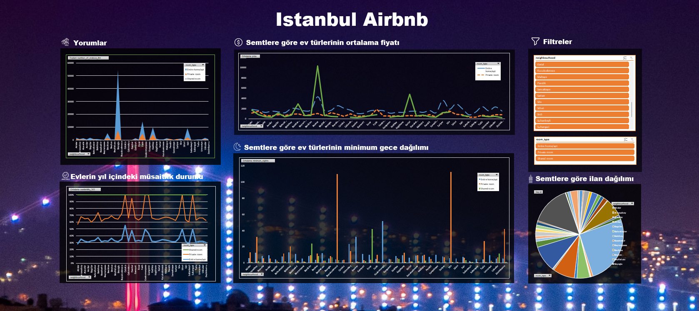

# Istanbul-Airbnb-Excel-Dashboard
This Excel Dashboard is originally created for a course project with the aim of learning how to interactively present your data using one of the most common tool, the Excel itself.

First I have applied some explatory data analysis, cleaned and organized my data then moved on to creating some Pivot charts and developing the dashboard. The final product, the dashboard does functionally work but has some logical problems. That is because of that I have choosen the data set before planning what I really wanted to achieve with the dashboard as my main goal was to "learn" how create an interactive dashboard. 

I have completed the project using fundamental Excel formulas, functions and some VBA. All of the processes are documented through a Power Point slide. I tried to make sure all of my "learning curve" is presented there for any other newbies. The document is in Turkish but Google translate would be more than enough to translate as the sentence structures are short and basic. Also, it is highly visual that you would understand what is going on before even translating. 

As a side note: I used basic VBA codes for data cleaning. VBA is not something required for my work duties so my knowledge was limited. However I am familiar with programming languages. So there are probably better ways to fill and organize your data than removing them; but having good quality data was not within the scope this time.  

The original data source is from http://insideairbnb.com/istanbul . Inside Airbnb is a project that provides data on Airbnb's impact on residential communities. Data is collected, cleaned, organized, and made ready for use by the Inside Airbnb. I have selected Istanbul however there are many other cities to select from.

I don't recommend using this "exact" project for yourself - for example do not deliver it as your homework, etc. as there are issues with it. However I do recommend getting inspired from it as it is kind of a step-by-step guide and I also shared my original resources to learn from in the presentation.

